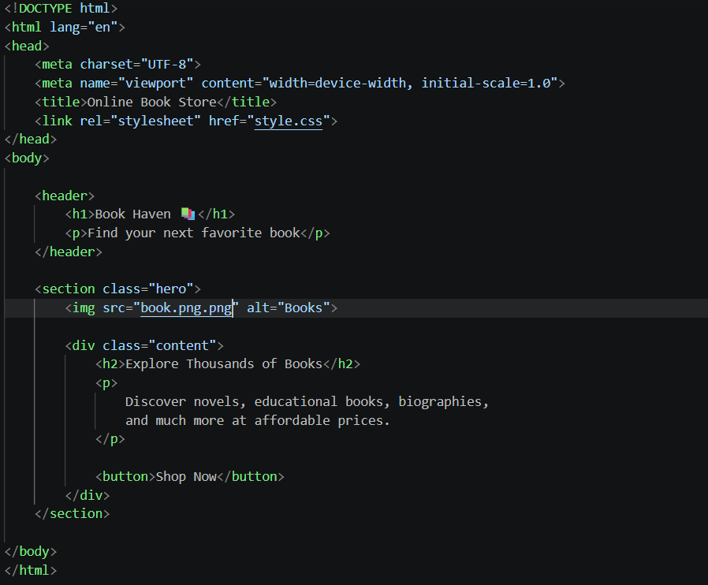
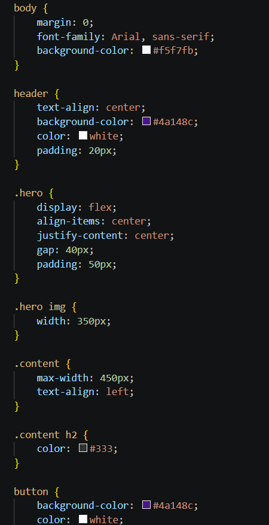

# 📚 Online Book Store

A simple web project created using HTML and CSS.

This website demonstrates the use of CSS properties such as:

- text-align
- font-family
- hover effects
- colors
- margin and padding
- border-radius
- flexbox

## 🚀 Features

- Responsive homepage
- Attractive hero section
- Interactive buttons with hover effects
- Book illustrations and icons

## 🛠️ Technologies Used

- HTML5
- CSS3

## 📸 Screenshots

### HTML Code

### CSS Code

### Project Output

## 👨‍💻 Author

sakshi Nagade
